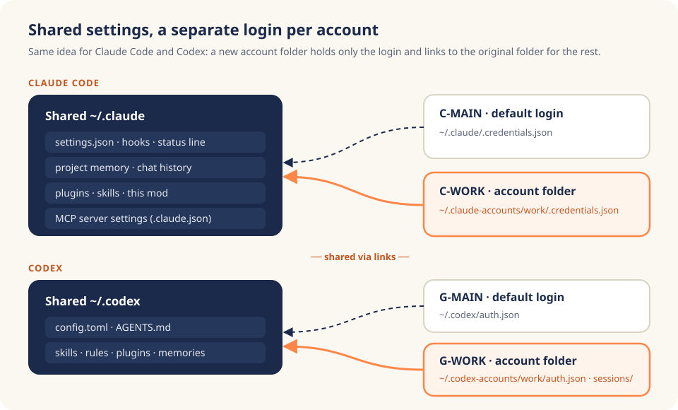

<p align="right"><a href="README.md">한국어</a> · <b>English</b></p>

<p align="center">
  
</p>

<h1 align="center">claude-ai-accounts</h1>

<p align="center">
  For <b>Claude Code</b> and <b>Codex</b> alike: pick a subscription <b>per session</b>,<br>
  see what is left, and <b>switch the moment you need to</b>.
</p>

<p align="center">
  
  
  
  
  <a href="https://mcpy.kr/en?utm_source=github&utm_medium=referral&utm_campaign=claude-ai-accounts&utm_content=badge_en"></a>
</p>

---

## At a glance

- **Pin an account per session, in Claude Code and in Codex.** `ai claude C-WORK`, `ai codex G-MAIN`. Window A on your work Claude, B on your personal Claude, C on your work ChatGPT, all at once, never mixed, with no logout and login dance.
- **Switch as soon as a limit runs out.** A Claude Code session restarts in the same pane on another account and keeps the conversation; Codex called from inside Claude moves to the new account on its next call.
- **One table for both tools.** Remaining 5-hour and 7-day limits plus reset times for every Claude and ChatGPT account, via `ai status` or the strip above the prompt.
- **Shared settings, separate logins.** Claude's hooks, memory, plugins and MCP settings, and Codex's `config.toml`, `AGENTS.md` and skills are shared by every account.
- No undocumented APIs, and the tool never reads or stores your tokens.

<p align="center">
  
  <br><sub>A real screenshot with demo accounts. C- rows are Claude accounts, G- rows are ChatGPT (Codex) accounts. ▶ marks the accounts this session uses; colors go from green to yellow to red as the limit runs out. The UI text is in Korean for now.</sub>
</p>

## Quick start

```bash
git clone https://github.com/mcpysup-netizen/claude-ai-accounts.git
cd claude-ai-accounts && ./install.sh

ai add claude work C-WORK company && ai login claude C-WORK   # add a Claude account
ai add codex  work G-WORK company && ai login codex  G-WORK   # add a ChatGPT (Codex) account

ai claude C-WORK      # this session runs on the work Claude
ai codex  G-WORK      # this session runs on the work ChatGPT
```

That alone gives you per-session accounts in both tools. For the strip above the prompt (limits table and click-to-switch), start `claude` inside tmux and type (answer `y`, then pick `user`):

```text
/plugin install ai-accounts --marketplace mcpysup-netizen/claude-ai-accounts
```

---

## Why this exists

<p align="center"></p>

With several Claude and ChatGPT subscriptions, there are two moments when you want to choose the account.

**Some sessions should always run on a specific account.** Company repos on the company account, personal projects on your own. But both Claude Code and Codex keep one machine-wide login (`~/.claude`, `~/.codex`), so switching it also switched every other open session. There was no way to give each session its own account.

**And sometimes a limit runs out.** Claude and Codex both have 5-hour and weekly limits, and when one hits, that session stops. Another account may have plenty left, but getting there meant logging out, logging in and approving in the browser again.

This tool handles both the same way: pick the account when you start a session with `ai claude <account>` or `ai codex <account>`, and click a name in the strip if you need to change it midway. I built it to split two Claude and two ChatGPT subscriptions like this every day, then cleaned it up for others. Most pitfalls below are ones I actually hit.

## Shared settings, separate logins

<p align="center"></p>

Both tools can move their login folder with an environment variable: `CLAUDE_CONFIG_DIR` for Claude Code ([docs](https://code.claude.com/docs/en/env-vars)) and `CODEX_HOME` for Codex ([docs](https://learn.chatgpt.com/docs/config-file/config-advanced)). But giving each account a whole folder of its own **silently splits your settings too.** A hook or `AGENTS.md` you fix on account A never applies on account B, and B forgets last week's memory.

So an account folder holds **only the login for real; everything else is a symlink back to the original folder.**

```text
~/.claude-accounts/work/                      ~/.codex-accounts/work/
├── .credentials.json   ← Claude login         ├── auth.json        ← Codex login
├── .claude.json        ← account keys only    ├── sessions/        ← this account's chats
└── settings.json, projects/, plugins/ ...    └── config.toml, AGENTS.md, skills/ ...
      → ~/.claude/... (symlinks)                     → ~/.codex/... (symlinks)
```

On the Claude side, `.claude.json` is the one copy, because it mixes shared settings (like the MCP server list) with "who is logged in". Each launch re-copies the shared part and keeps only the account keys (`oauthAccount` and friends). On the Codex side, chat history (`sessions/`) is kept per account. Your existing default logins (`~/.claude`, `~/.codex`) are left untouched.

<p align="center"></p>

## Switching midway

<p align="center"></p>

You cannot change the login of a running session from outside, so each case works a little differently.

**Claude Code session: restart in the same pane, keep the conversation.** Click another Claude account in the strip and `ai swap` reads the original arguments (permission mode and so on) from the `claude` process in the current tmux pane, then half a second later respawns that pane as `ai claude <new account> <original args> --resume <this session>`. Layout, permission mode and conversation stay; only the login changes.

**Codex called from inside Claude: no restart at all.** Click a G- account and the next Codex call uses it. The Codex plugin shares one broker process per working folder, which can end up running on whichever session's account started it first, so the mod prefixes Codex commands with this session's `CODEX_HOME` and gives each account its own broker.

**Standalone Codex session: start it again on the new account.** `/exit`, then `ai codex <new account>`. Because chat history lives in each account's folder, the conversation does not follow you to another account; within the same account, `ai codex G-WORK resume` picks it up again.

## Where the numbers come from

| | Source | Refreshed |
|---|---|---|
| **Claude** | `rate_limits` in the status line input ([docs](https://code.claude.com/docs/en/statusline)) | only while you use that account |
| **Codex** | `account/rateLimits/read` on `codex app-server` ([docs](https://learn.chatgpt.com/docs/app-server)) | every minute, costs no quota |

Both are **account-wide values from the server**, so usage on other machines shows up too. Claude, however, offers no official way to ask about an account you are not using, so you see the **last observed value**. Anything older than an hour is dimmed and tagged with its age.

Calling the private endpoint behind `/usage` with your token would make Claude live as well. It is undocumented and can change any time, and it would mean opening your token file, so the public version leaves it out.

---

## Install

| Needs | Notes |
|---|---|
| Linux or WSL | in-place switching reads `/proc`; no macOS yet |
| `python3`, `bash` | |
| [Claude Code](https://code.claude.com/docs) 2.1.29x | for mods (plugin hooks); tested on 2.1.295 |
| `tmux` | for click-to-switch; `ai claude` and `ai codex` work without it |
| Codex CLI | for ChatGPT accounts |

**1. Install.** `./install.sh` creates `~/.local/bin/ai` and a registry at `~/.config/ai-accounts/accounts.json`, registering your current logins as `C-MAIN` and `G-MAIN`. It is safe to re-run and never overwrites an existing registry or status line.

**2. One status line hook.** With no status line configured, the installer wires a minimal one. If you already have one, add this line to your script. It is the only way Claude limits get recorded.

```bash
printf '%s' "$input" | ai record 2>/dev/null   # $input = status line JSON
```

**3. Add accounts and log in.**

```bash
ai add claude work C-WORK company 'Max 20x'   # id, label (≤12 chars), company|personal, plan
ai login claude C-WORK                         # in Claude: /login → approve in browser → /exit
ai add codex work G-WORK company Pro
ai login codex G-WORK
```

**4. Install the mod** with the `/plugin install …` line above, inside `claude` in tmux.

## Usage

| To | Claude Code | Codex |
|---|---|---|
| run this session on the work account from the start | `ai claude C-WORK` | `ai codex G-WORK` |
| continue an earlier chat | `ai claude C-WORK --resume <session-id>` | `ai codex G-WORK resume` |
| also pick the Codex account used inside Claude | `ai claude C-WORK gpt:G-MAIN` | |
| switch midway | click a name in the strip, or `/ai C-WORK` | inside Claude: click a G- name / standalone: start again with `ai codex <account>` |

For both tools, `ai status` lists remaining limits and `/ai` opens the donut panel. Extra arguments after `ai claude` or `ai codex` go straight to `claude` or `codex`.

## Security

| Path | Contents | Secrets |
|---|---|---|
| `~/.config/ai-accounts/accounts.json` | account ids, labels, company/personal, plan, folder paths | none |
| `~/.claude-accounts/<id>/.credentials.json` | Claude login (managed by Claude Code) | yes, never opened by this tool |
| `~/.codex-accounts/<id>/auth.json` | Codex login (managed by Codex CLI) | yes, never opened by this tool |
| `~/.cache/ai-usage/*.json` | usage % and reset times | none |

`ai login` simply launches Claude's `/login` or `codex login`. The tool makes no network requests of its own; folders are created `700` and files `600`.

## Common pitfalls

- **MCP logins are per account.** MCP *settings* are shared, but MCP *tokens* live in each account's `.credentials.json`. I once moved an automation to a new account and it stalled for exactly this reason. Log in once via `/mcp` on each new account.
- **claude.ai connectors (Gmail, Drive and so on) belong to the account.** Unlike local MCP servers, you only see the ones connected on that account.
- **A standalone Codex chat does not move between accounts.** History lives in each account folder (`~/.codex-accounts/<id>/sessions`), so pick the account before a long task.
- **Clicks do nothing?** Make sure `~/.tmux.conf` has `set -g mouse on`. Outside tmux the tool tells you how to switch manually instead.

## Limitations

- No macOS or native Windows yet (WSL works).
- Unused Claude accounts cannot be checked live (Codex is refreshed live every minute).
- The strip and click-to-switch live in Claude Code. A standalone Codex window has no strip; use `ai status` there.
- Claude Code mods are early access and may break between releases. Please open an issue if they do.
- Messages and the strip are in Korean for now.

## Uninstall

```bash
./install.sh --uninstall      # removes the ai command and scripts
```

Remove the mod with `/plugin uninstall ai-accounts`. The registry and per-account login folders are kept so you do not lose logins; delete them yourself if you no longer need them.

---

## Made by McPY

<a href="https://mcpy.kr/en?utm_source=github&utm_medium=referral&utm_campaign=claude-ai-accounts&utm_content=footer_en"><b>McPY</b></a> solves marketing and business problems with data, code, AI and automation, and turns the solutions into products and knowledge. This tool is one of them: a daily annoyance turned into a system.

Further reading

- [Claude Plans and Pricing: Free, Pro and Max Usage Limits](https://mcpy.kr/en/blog/claude-plans-price-usage-limits-2026?utm_source=github&utm_medium=referral&utm_campaign=claude-ai-accounts&utm_content=related_en)
- [Claude Code Token Usage: Why It Drains Fast and How to Cut It](https://mcpy.kr/en/blog/claude-code-token-usage-guide?utm_source=github&utm_medium=referral&utm_campaign=claude-ai-accounts&utm_content=related_en)
- [Claude Code Install, Pricing and Usage Limits (2026 Guide)](https://mcpy.kr/en/blog/claude-code-install-price-usage-limits-2026?utm_source=github&utm_medium=referral&utm_campaign=claude-ai-accounts&utm_content=related_en)
- [Codex Cloud Tasks: How to Start and Plan Requirements](https://mcpy.kr/en/blog/codex-cloud-tasks-plans?utm_source=github&utm_medium=referral&utm_campaign=claude-ai-accounts&utm_content=related_en)

## Sources

- [Claude Code, Status line](https://code.claude.com/docs/en/statusline): `rate_limits` in the status line input
- [Claude Code, Environment variables](https://code.claude.com/docs/en/env-vars): `CLAUDE_CONFIG_DIR`
- [Claude Code, Plugin marketplaces](https://code.claude.com/docs/en/plugin-marketplaces): installing plugins from a GitHub repository
- [Codex, Advanced configuration](https://learn.chatgpt.com/docs/config-file/config-advanced): `CODEX_HOME`
- [Codex, App server](https://learn.chatgpt.com/docs/app-server): `account/rateLimits/read`

The four illustrations are AI-generated explainers; the screenshot uses demo accounts. · MIT License
