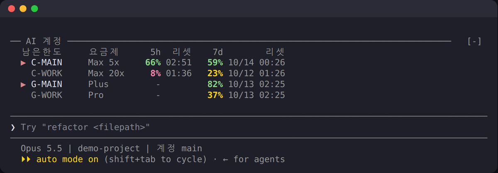
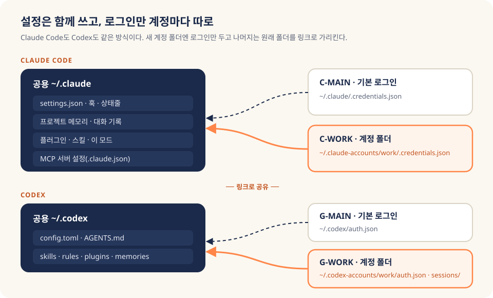

<p align="center">
  
</p>

<h1 align="center">claude-ai-accounts</h1>

<p align="center">
  Claude Code와 Codex(ChatGPT) 구독 계정을 <b>세션마다 골라 쓰고</b>,<br>
  계정별 남은 한도를 입력창 바로 위에서 보면서 <b>클릭 한 번으로 바꾸는</b> 도구
</p>

<p align="center">
  
  
  
  
</p>

---

## 30초 요약

- **무엇:** Claude 구독이나 ChatGPT(Codex) 구독을 2개 이상 쓸 때 쓰는 도구예요. 계정을 고를 때 **로그아웃·로그인을 다시 하지 않아도 되고**, 세션 A는 회사 계정, 세션 B는 개인 계정처럼 **동시에** 따로 굴릴 수 있습니다.
- **보이는 것:** 입력창 바로 위에 계정별 **남은 한도(5시간·7일)와 리셋 시각**이 표로 뜹니다. 계정 이름을 누르면 **지금 그 칸에서 그 계정으로 다시 시작하고, 대화는 그대로 이어집니다.**
- **공유되는 것:** 훅, 메모리, 플러그인, MCP 설정은 모든 계정이 **같이 씁니다.** 계정마다 따로인 건 로그인 파일뿐이에요.
- **안 하는 것:** 비공식 API를 부르지 않고, 토큰을 따로 꺼내 저장하지도 않습니다. 로그인은 Claude·Codex가 원래 하던 방식 그대로예요.

```bash
git clone https://github.com/mcpysup-netizen/claude-ai-accounts.git
cd claude-ai-accounts && ./install.sh
ai add claude work C-WORK company && ai login claude C-WORK
```

그다음 tmux 안에서 `claude`를 켜고 프롬프트에 아래 한 줄을 입력하면 띠가 생깁니다.

```text
/plugin install ai-accounts --marketplace mcpysup-netizen/claude-ai-accounts
```

<p align="center">
  
  <br><sub>실제 실행 화면입니다. 계정 이름과 숫자는 시연용 가짜 계정이에요. ▶는 이 세션이 쓰는 계정이고, 남은 양이 적을수록 초록에서 노랑, 빨강으로 바뀝니다.</sub>
</p>

---

## 목차

1. [한도가 차면 일이 멈춘다](#한도가-차면-일이-멈춘다)
2. [설정은 함께, 로그인만 따로](#설정은-함께-로그인만-따로)
3. [같은 자리에서 계정만 바꿔 다시 시작](#같은-자리에서-계정만-바꿔-다시-시작)
4. [남은 한도 숫자는 어디서 오나](#남은-한도-숫자는-어디서-오나)
5. [설치](#설치)
6. [사용법](#사용법)
7. [보안: 무엇이 어디에 저장되나](#보안-무엇이-어디에-저장되나)
8. [처음 쓰는 사람이 막히는 곳](#처음-쓰는-사람이-막히는-곳)
9. [한계와 버린 방법](#한계와-버린-방법)
10. [제거](#제거)
11. [근거·출처](#근거출처)

---

## 한도가 차면 일이 멈춘다

<p align="center"></p>

구독을 여러 개 결제해 두고도 일이 멈추는 순간이 있어요. Claude 계정 하나의 5시간 한도가 차면 그 세션은 멈춥니다. 다른 계정은 한도가 넉넉한데도 그쪽으로 가려면 `/logout`, `/login`, 브라우저 승인을 다시 거쳐야 했죠.

더 곤란한 건 **로그인이 PC 전체에 하나**라는 점이었습니다. 계정을 바꾸면 열어 둔 다른 세션도 같이 바뀌어서, 회사 작업 창과 개인 작업 창을 나눠 쓸 수가 없었어요.

이 도구는 그 불편에서 시작했습니다. 처음엔 제 PC에서만 쓰려고 만들었고, Claude 2계정과 GPT 2계정을 매일 오가며 다듬은 걸 공개용으로 정리했어요. 그래서 문서에 적은 함정은 대부분 **직접 겪은 것**이고, 겪지 않은 부분은 그렇다고 따로 적었습니다.

이 문서가 답하는 질문은 세 가지예요.

- 로그인을 세션마다 나누면서 **설정은 어떻게 하나로 유지하나?**
- 실행 중인 세션의 계정을 **어떻게 대화를 잃지 않고 바꾸나?**
- 띠에 보이는 **남은 한도 숫자는 얼마나 믿을 수 있나?**

---

## 설정은 함께, 로그인만 따로

<p align="center"></p>

Claude Code는 설정 폴더 위치를 `CLAUDE_CONFIG_DIR` 환경변수로 바꿀 수 있어요([공식 문서](https://code.claude.com/docs/en/env-vars)). 계정마다 폴더를 따로 주면 로그인이 갈라지니, 처음엔 이걸로 끝인 줄 알았습니다.

그런데 그렇게 하면 **훅, 메모리, 플러그인, MCP 설정까지 전부 갈라져요.** 계정 A에서 고친 훅이 계정 B에선 안 돌고, 계정 B 세션은 지난주 메모리를 모릅니다. 에러도 안 나고 조용히 다르게 동작해서 더 위험하죠.

그래서 `ai claude <계정>`은 계정 폴더를 이렇게 만듭니다.

```text
~/.claude-accounts/work/
├── .credentials.json     ← 이 계정 로그인 (Claude가 직접 씀)
├── .claude.json          ← 공용 설정 복사본 + 이 계정 정보 키만 보존
├── settings.json  → ~/.claude/settings.json   (링크)
├── projects/      → ~/.claude/projects/       (링크, 메모리·대화 기록)
├── plugins/       → ~/.claude/plugins/        (링크)
└── ...            → ~/.claude/...             (나머지 전부 링크)
```

코드처럼 보여도 어렵지 않아요. **로그인 파일만 진짜 파일이고, 나머지는 원래 폴더를 가리키는 바로가기**라는 뜻입니다. `~/.claude`에 새 항목이 생기면 다음 실행 때 링크가 자동으로 추가돼요.

`.claude.json`만 예외로 복사본입니다. 이 파일엔 MCP 서버 목록 같은 공용 설정과 "누구로 로그인했나" 같은 계정 정보가 섞여 있어서, 링크로 묶으면 계정 정보가 서로 덮어써지거든요. 그래서 실행할 때마다 공용 설정을 새로 복사하고 계정 키(`oauthAccount` 등)만 그 계정 것으로 남깁니다.

Codex도 같은 원리예요. Codex는 `CODEX_HOME`으로 홈 폴더를 바꿀 수 있어서([공식 문서](https://developers.openai.com/codex/config-advanced)) 계정마다 폴더를 주고, `config.toml`, `AGENTS.md`, 스킬, 규칙은 `~/.codex`로 링크합니다. 계정마다 따로인 건 `auth.json`과 실행 기록뿐이에요.

<p align="center"></p>

> **기본 계정은 손대지 않아요.** 평소 쓰던 `~/.claude` 로그인은 등록부에 `auth: default`로 들어가고 그대로 둡니다. 새로 추가하는 계정만 계정 폴더를 씁니다.

---

## 같은 자리에서 계정만 바꿔 다시 시작

<p align="center"></p>

여기서 막혔던 게 하나 있어요. **실행 중인 Claude 세션의 로그인은 밖에서 바꿀 수 없습니다.** 모드(Claude Code 플러그인) API에도 그런 기능이 없어요.

그래서 방향을 바꿨습니다. 바꾸지 말고 **같은 자리에서 다시 띄우면** 돼요. 띠에서 다른 Claude 계정 이름을 누르면 이렇게 진행됩니다.

1. 모드가 이 세션의 ID와 tmux 칸(pane) 번호를 `ai swap`에 넘깁니다.
2. `ai swap`이 그 칸에서 돌고 있는 `claude` 프로세스를 찾아 **원래 실행 인자**(권한 모드, `--plugin-dir` 등)를 읽어요.
3. 0.5초 뒤 `tmux respawn-pane`으로 같은 칸을 `ai claude <새 계정> <원래 인자> --resume <이 세션 ID>`로 다시 띄웁니다.

결과적으로 **창 배치도, 권한 모드도, 대화도 그대로이고 로그인만 바뀝니다.** 0.5초를 기다리는 데는 이유가 있어요. 지금 Claude가 "전환 시작" 응답을 받기 전에 꺼지면 실패로 보이기 때문에, 응답이 끝난 다음 다시 띄웁니다.

**GPT(Codex) 계정은 다시 띄울 필요가 없어요.** 띠에서 GPT 이름을 누르면 이 세션에서 다음에 부르는 Codex부터 그 계정으로 돕니다. Claude 안에서 Codex를 부르는 Bash 명령 앞에 이 세션 계정의 `CODEX_HOME`을 붙이는 방식이에요.

> **왜 굳이 명령 앞에 붙이나?** Codex 플러그인은 같은 작업 폴더의 세션들이 중계 프로세스 하나를 같이 씁니다. 그 프로세스는 처음 띄운 세션의 계정을 물려받아서, 세션마다 GPT 계정을 다르게 해도 먼저 띄운 세션 계정으로 돌 수 있어요. 그래서 계정별로 플러그인 데이터 폴더를 나눠 중계 프로세스도 계정마다 따로 뜨게 했습니다.

---

## 남은 한도 숫자는 어디서 오나

숫자를 믿으려면 출처를 알아야 하니 정직하게 적을게요.

| | 출처 | 갱신 시점 | 다른 PC 사용 반영 |
|---|---|---|---|
| **Claude** | Claude Code가 상태줄 스크립트에 넘기는 `rate_limits` ([공식 문서](https://code.claude.com/docs/en/statusline)) | **그 계정으로 세션을 쓸 때만** | 반영(서버가 준 계정 전체 값) |
| **Codex** | Codex CLI의 `codex app-server`에 `account/rateLimits/read` 요청 ([공식 문서](https://developers.openai.com/codex/app-server)) | 1분마다 | 반영 |

**Codex 숫자는 실시간에 가깝습니다.** 모델을 부르지 않는 조회라 한도도 닳지 않아요. 조회가 실패하면 그 계정 실행 기록에 남은 마지막 값을 씁니다.

**Claude 숫자는 "마지막으로 본 값"이에요.** 공식 경로로는 지금 안 쓰는 계정의 한도를 물어볼 방법이 없습니다. 그래서 계정 C-WORK를 3시간 안 썼다면 띠의 C-WORK 숫자는 3시간 전 값이에요. 이런 값은 1시간이 지나면 **흐리게 표시하고 이름 옆에 `3h전`처럼 경과 시간을 붙입니다.** 리셋 시각이 지난 창은 `리셋됨`으로 보여요.

> **비공식 API는 일부러 안 씁니다.** `/usage` 화면이 쓰는 주소를 로그인 토큰으로 직접 부르면 Claude도 실시간에 가까워져요. 실제로 제 PC에선 그렇게 써 봤고 숫자도 맞았습니다. 하지만 공개 문서에 없는 주소라 언제 바뀔지 모르고, 도구가 로그인 토큰 파일을 직접 열어야 해요. 공개판에서는 그 대가가 이득보다 크다고 보고 뺐습니다.

---

## 설치

### 준비물

| 필요 | 이유 |
|---|---|
| Linux 또는 WSL | 같은 칸 전환이 `/proc`에서 프로세스 인자를 읽어요. macOS는 아직 안 됩니다. |
| `python3`, `bash` | `ai` 명령과 사용량 계산 |
| [Claude Code](https://code.claude.com/docs) 2.1.29x | 모드(플러그인 훅) 기능. 2.1.295에서 확인했어요. |
| `tmux` | 클릭 한 번으로 같은 칸 전환. 없어도 `ai claude <계정>`은 됩니다. |
| Codex CLI (선택) | GPT 계정 기능을 쓸 때만 |

### 1. 받고 설치하기

```bash
git clone https://github.com/mcpysup-netizen/claude-ai-accounts.git
cd claude-ai-accounts
./install.sh
```

`install.sh`가 하는 일은 네 가지예요. 여러 번 실행해도 안전하고, 이미 있는 등록부와 상태줄은 덮어쓰지 않습니다.

- `~/.local/share/ai-accounts/`에 스크립트를 복사하고 `~/.local/bin/ai`로 연결
- 등록부 `~/.config/ai-accounts/accounts.json` 생성 (지금 로그인된 Claude = `C-MAIN`, `~/.codex` = `G-MAIN`)
- 상태줄이 **비어 있을 때만** 최소 상태줄 연결 (원래 `settings.json`은 `.bak-ai-accounts-*`로 백업)
- 상태줄이 이미 있으면 그 스크립트에 넣을 **한 줄**만 알려 줌

```bash
# 이미 쓰는 상태줄 스크립트가 있다면, 입력 JSON을 받은 직후 이 한 줄을 추가
printf '%s' "$input" | ai record 2>/dev/null
```

이 한 줄이 Claude 남은 한도를 기록하는 유일한 통로라 꼭 넣어 주세요.

### 2. 계정 추가하고 로그인하기

```bash
ai add claude work C-WORK company 'Max 20x'   # id, 표시명, company|personal, 요금제(선택)
ai login claude C-WORK                         # Claude가 뜨면 /login → 브라우저 승인 → /exit

ai add codex work G-WORK company Pro
ai login codex G-WORK                          # 브라우저에서 그 계정으로 승인
```

표시명은 영문·숫자 12자 이내로 정해요. 띠에 표처럼 정렬해야 해서 길이를 제한했습니다. `company`·`personal` 표시는 띠의 패널에서 회사 계정과 개인 계정을 구분해 보여 줄 때 씁니다.

### 3. 모드(띠) 설치하기

tmux 안에서 `claude`를 실행하고, 프롬프트에 입력하세요.

```text
/plugin install ai-accounts --marketplace mcpysup-netizen/claude-ai-accounts
```

`Add marketplace?`가 나오면 `y`, 범위는 맨 위 `user`를 고르면 됩니다. 설치가 끝나면 그 세션부터 입력창 위에 **AI 계정** 표가 떠요.

---

## 사용법

| 하고 싶은 것 | 명령 |
|---|---|
| 특정 Claude 계정으로 새 세션 | `ai claude C-WORK` |
| Claude는 C-WORK, Codex는 G-MAIN으로 | `ai claude C-WORK gpt:G-MAIN` |
| 기존 대화를 다른 계정으로 이어가기 | `ai claude C-WORK --resume <세션ID>` |
| Codex를 특정 계정으로 | `ai codex G-WORK` |
| 전 계정 남은 한도를 표로 | `ai status` |
| 띠에서 지금 칸을 다른 계정으로 | 계정 이름 클릭 (tmux에서 `set -g mouse on`) |
| 띠 클릭 대신 명령으로 전환 | `/ai C-WORK` |
| 새 tmux 창에 Codex만 따로 띄우기 | `/ai codex G-WORK` |
| 도넛 그래프 패널 열기 | `/ai` 또는 사용 중인 계정 이름 클릭 |

`ai claude` 뒤의 나머지 인자는 그대로 `claude`에 전달돼요. `--dangerously-skip-permissions` 같은 옵션도 평소처럼 붙이면 됩니다. 계정 이름은 대소문자를 가리지 않고, 등록부 id(`work`)로 써도 돼요.

---

## 보안: 무엇이 어디에 저장되나

이 도구는 **로그인 정보를 직접 다루지 않는 것**을 원칙으로 만들었어요.

| 위치 | 내용 | 비밀값 |
|---|---|---|
| `~/.config/ai-accounts/accounts.json` | 계정 id, 표시명, 회사/개인, 요금제 이름, 폴더 경로 | **없음** |
| `~/.claude-accounts/<id>/.credentials.json` | Claude 로그인 (Claude Code가 직접 쓰고 읽음) | 있음, 이 도구는 열지 않음 |
| `~/.codex-accounts/<id>/auth.json` | Codex 로그인 (Codex CLI가 직접 쓰고 읽음) | 있음, 이 도구는 열지 않음 |
| `~/.cache/ai-usage/*.json` | 계정별 사용률(%)·리셋 시각, 세션별 캐시 만료 시각 | **없음** |

- 계정 폴더와 등록부 폴더는 `700`, 캐시 파일은 `600` 권한으로 만들어 다른 사용자가 못 읽게 했어요.
- `ai login`은 Claude의 `/login`, Codex의 `codex login`을 **그대로 띄우기만** 합니다. 토큰을 화면에서 긁거나 따로 저장하지 않아요.
- 이 도구가 직접 하는 네트워크 요청은 없습니다. Codex 한도 조회도 설치된 `codex` CLI가 자기 로그인으로 처리해요.
- 이 저장소에는 개인 계정 정보, 이메일, 토큰, 개인 경로가 없습니다. 의심되면 받은 뒤 직접 확인해 보세요.

```bash
grep -rniE "sk-ant|@gmail|token|password|secret" --exclude-dir=.git .
```

검색 결과로는 이 README의 설명 문장, `.gitignore` 규칙, 그리고 `bin/ai`의 `unset CLAUDE_CODE_OAUTH_TOKEN` 한 줄만 나와야 정상이에요. 마지막 줄은 바깥에서 물려받은 토큰 환경변수가 계정 선택을 덮어쓰지 않도록 **지우는** 코드입니다.

---

## 처음 쓰는 사람이 막히는 곳

**MCP 로그인도 계정마다 따로예요.** 제가 실제로 겪은 사고입니다. 자동화 작업을 새 계정으로 돌렸더니 그 계정에 MCP 서버 로그인(OAuth)이 없어서 작업이 멈췄어요. MCP **설정**은 공유되지만 MCP **로그인 토큰**은 계정의 `.credentials.json`에 들어갑니다. 새 계정을 추가하면 그 계정으로 한 번 `/mcp`에 들어가 필요한 서버에 로그인하세요. 그다음부터는 토큰이 자동으로 갱신돼요.

**claude.ai 커넥터(Gmail, Drive 등)는 계정에 붙어 있어요.** 로컬 MCP는 모든 계정에서 똑같이 뜨지만, claude.ai 웹에서 연결한 커넥터는 그 계정 것만 보입니다. 이건 도구 문제가 아니라 원래 구조예요.

**새 계정 첫 실행 때 폴더 신뢰 질문이 다시 나올 수 있어요.** 계정 정보 키를 따로 두는 과정에서 나올 수 있으니 한 번 답하면 됩니다.

**띠를 눌러도 반응이 없으면 tmux 마우스를 확인하세요.** `~/.tmux.conf`에 `set -g mouse on`이 있어야 클릭이 전달돼요. tmux 밖에서 띄운 세션은 같은 칸 전환이 안 되고, 화면에 수동 방법(`/exit` 후 `ai claude <계정> --continue`)을 알려 줍니다.

**Claude 버전에 따라 tmux 칸 정보를 모드에 안 넘겨요.** 그럴 땐 `ai swap`이 부모 프로세스를 거슬러 올라가 칸을 직접 찾습니다. 백그라운드 세션(`claude --bg`)도 그 세션을 멈춘 뒤(대화는 보존) 지금 보고 있는 칸에서 이어 줘요.

**띠의 Claude 숫자가 오래돼 보이면 정상이에요.** 위 [남은 한도 숫자](#남은-한도-숫자는-어디서-오나) 절처럼 그 계정을 써야 갱신됩니다.

---

## 한계와 버린 방법

**아직 못 하는 것**

- macOS, Windows 네이티브는 지원하지 않아요(WSL은 됩니다).
- 안 쓰는 Claude 계정의 한도를 실시간으로 보는 건 공식 경로가 없어서 못 합니다.
- 모드 기능은 Claude Code에서 아직 초기 단계(early access)라 버전이 오르면 깨질 수 있어요. 깨지면 이슈로 알려 주세요.

**검토했다가 버린 방법**

| 방법 | 버린 이유 |
|---|---|
| 계정마다 `CLAUDE_CONFIG_DIR`을 통째로 분리 | 훅·메모리·MCP 설정이 조용히 갈라짐 |
| `claude setup-token` 장기 토큰을 환경변수로 주입 | 토큰을 도구가 보관해야 하고, 그 토큰엔 프로필 권한이 없어 일부 기능이 막힘 |
| Codex에 `OPENAI_API_KEY` 사용 | 구독이 아니라 API 사용량 과금으로 빠짐 |
| 전환할 때 새 tmux 창 열기 | 창이 계속 늘어남. 같은 칸 다시 띄우기로 교체 |
| 비공식 사용량 API | 위 [보안](#보안-무엇이-어디에-저장되나)·[숫자 출처](#남은-한도-숫자는-어디서-오나) 절 참고 |

---

## 제거

```bash
./install.sh --uninstall          # ai 명령과 스크립트만 제거
```

Claude Code에서 `/plugin uninstall ai-accounts`로 모드를 지웁니다. 등록부(`~/.config/ai-accounts`)와 계정별 로그인 폴더(`~/.claude-accounts`, `~/.codex-accounts`)는 실수로 로그인을 잃지 않도록 남겨 둬요. 필요 없으면 직접 지우면 됩니다. 상태줄을 설치기가 연결했다면 `settings.json.bak-ai-accounts-*` 백업으로 되돌릴 수 있어요.

---

## 오늘 할 일

1. `./install.sh`를 돌리고, 평소 쓰던 계정이 `ai status`에 `C-MAIN`으로 보이는지 확인하세요.
2. 두 번째 계정을 `ai add`로 넣고 `ai login`으로 한 번 로그인하세요.
3. 상태줄을 원래 쓰고 있었다면 `ai record` 한 줄을 넣었는지 확인하세요.
4. tmux에서 모드를 설치하고, 띠의 계정 이름을 눌러 같은 칸에서 바뀌는지 보세요.
5. 새 계정으로 `/mcp`에 들어가 자주 쓰는 MCP 서버에 로그인하세요.

---

## 근거·출처

- [Claude Code, Status line 설정](https://code.claude.com/docs/en/statusline): 상태줄 입력 JSON의 `rate_limits`(5시간·7일 사용률, 리셋 시각) 근거
- [Claude Code, Environment variables](https://code.claude.com/docs/en/env-vars): `CLAUDE_CONFIG_DIR`로 설정 폴더를 바꾸는 근거
- [Claude Code, Plugin marketplaces](https://code.claude.com/docs/en/plugin-marketplaces): GitHub 저장소를 마켓플레이스로 추가해 플러그인을 설치하는 근거
- [Codex, Advanced configuration](https://developers.openai.com/codex/config-advanced): `CODEX_HOME`으로 Codex 홈 폴더를 바꾸는 근거
- [Codex, App server](https://developers.openai.com/codex/app-server): `account/rateLimits/read`로 계정 한도를 조회하는 근거

이미지 중 일러스트 4장은 AI로 만든 설명용 그림이고, 실행 화면 캡처는 시연용 가짜 계정으로 찍었습니다.

---

<details>
<summary><b>English summary</b></summary>

**claude-ai-accounts** lets you run several Claude Code and Codex (ChatGPT) subscriptions side by side on one Linux/WSL machine.

- `ai claude <account>` / `ai codex <account>` start a session on a chosen subscription. Only the login files are per account; hooks, memory, plugins and MCP settings stay shared through symlinks (`CLAUDE_CONFIG_DIR`, `CODEX_HOME`).
- A Claude Code mod shows remaining 5-hour / 7-day limits for every account above the prompt. Clicking an account name respawns the current tmux pane on that account and resumes the same conversation (`--resume`).
- Claude numbers come from the official status line `rate_limits` (last observed value). Codex numbers come from `codex app-server` `account/rateLimits/read`. No undocumented APIs, and the tool never reads or stores tokens.

Install: `./install.sh`, then `/plugin install ai-accounts --marketplace mcpysup-netizen/claude-ai-accounts` inside Claude Code.

</details>

<p align="center"><sub>MIT License</sub></p>
